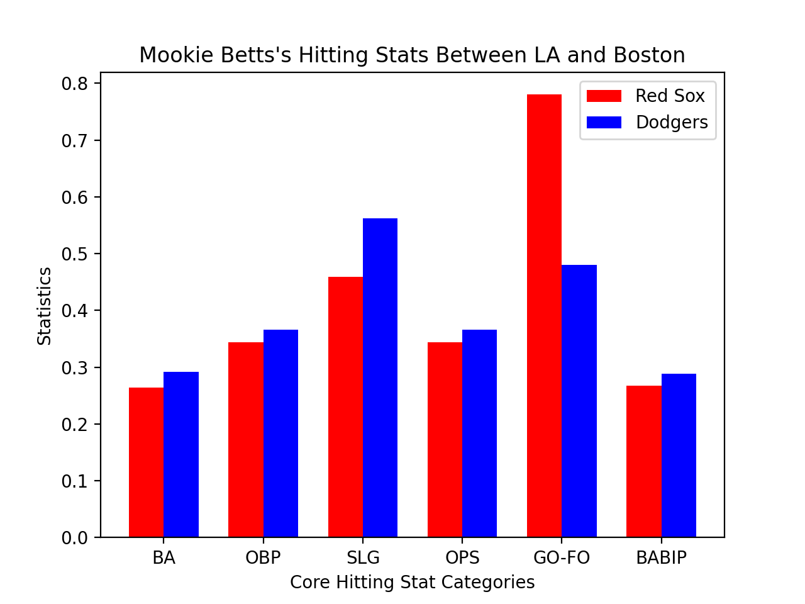

# Matplotlib/Json Lab

## Plot 1

### Mookie Betts's Joint Bar Graph:

**Description:** 
The following joint bar graph was based on Mookie Betts's (a baseball player) performance between 2017 as a Red Sox player
and 2020 as a Dodgers player. This shows that Mookie Betts is hitting much better as a Dodger than he did as part of the 
Red Sox in 2017, despite playing during the pandemic. It's a tribute to how good Mookie is as a player, and how he's always 
in the MVP discussion. 

*If you want to find out more about where I got the data set, check out the [MLB API](https://appac.github.io/mlb-data-api-docs/)!*

 
## Plot 2

### Barry TV Show Ratings Comparison:

**Description:**
The pie chart shows us multiple things, from the increasing popularity of Barry to how popular the show has gotten over time. 
The percentages represent the popularity of the episodes of Barry that aired from March 13, 2019 to May 5, 2019. We can see that 
the episode that had the most popularity was the show that aired on April 28, 2019. 

*If you want to know where I got the info on Barry's ratings, check out the [BaseDig API for Barry](https://www.basedig.com/wikipedia/811barry-tv-series-reception-ratings-526902/)!*

#### This Assignment!
I retrieved all of this info from different APIs scattered throughout the internet. If you want to check out this assignment and
others who have completed this assignment, click [here](https://github.com/mikeizbicki/cmc-csci040/tree/2020fall/hw_02)!